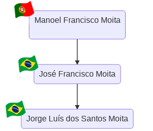

## Documentos para processo de pedido de nacionalidade portuguesa

Os documentos abaixo foram enviados como parte do processo de pedido de nacionalidade portuguesa, tendo como declarante **Jorge Luís dos Santos Moita**, brasileiro nascido em Rio Grande-RS e neto de **Manoel Francisco Moita**, português nascido na freguesia de Oliveirinha, concelho de Aveiro.

Contato: [raphael.moita@gmail.com](raphael.moita@gmail.com)

  

 
---------------------------------------------------------------------------------------------------------------------- 
 Todos documentos abaixo foram certificados de acordo com Apostilamento de Haia  
---------------------------------------------------------------------------------------------------------------------- 
 

- [x] &nbsp; Formulário de declaração para atribuição da nacionalidade portuguesa: [visualizar](documentos_enviados/formulario.pdf)  
- [x] &nbsp; Certidão do registo de nascimento do interessado: [visualizar](documentos_enviados/certidao_nascimento_jorge.pdf)  
- [x] &nbsp; Certificado do registo criminal estrangeiro, emitido no Brasil: [visualizar](documentos_enviados/antecedentes_criminais_jorge.pdf)  
- [x] &nbsp; Carteira de identidade brasileira do interessado: [visualizar](documentos_enviados/carteira_identidade_jorge.pdf)  
- [x] &nbsp; Certidão do registo de nascimento do ascendente do segundo grau, da linha reta (avó/avô), português: [visualizar](documentos_enviados/certidao_batismo_manoel.pdf) 
- [x] &nbsp; Certidão do registo de nascimento do progenitor (mãe/pai) que é descendente do nacional português: [visualizar](documentos_enviados/certidao_nascimento_jose.pdf)  

 

  2021

<noscript>
  
</noscript>
